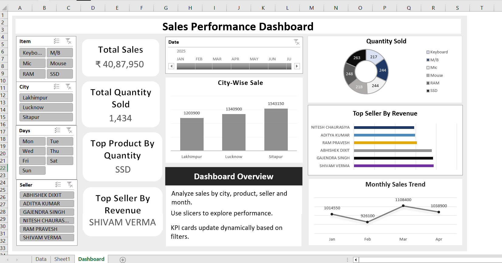

# Sales Performance Dashboard - Excel

## Overview

This project is an interactive Sales Performance Dashboard built in Microsoft Excel to analyze sales performance across products, cities, sellers, and time periods.

## Features

* KPI Cards:

  * Total Sales
  * Total Quantity Sold
  * Top Product by Quantity
  * Top Seller by Revenue

* Interactive Filters:

  * Product Slicer
  * City Slicer
  * Seller Slicer
  * Day Slicer
  * Date Timeline

* Visualizations:

  * City-wise Sales Analysis
  * Product Quantity Distribution
  * Seller-wise Revenue Analysis
  * Monthly Sales Trend

## Tools Used

* Microsoft Excel
* Pivot Tables
* Pivot Charts
* Slicers
* Timeline Filters
* Dashboard Design

## Business Insights

* Identify top-performing sellers and products.
* Analyze sales performance across cities.
* Monitor monthly sales trends.
* Enable dynamic reporting through interactive filters.

## Dashboard Preview

## Project Outcome

Built an interactive reporting solution that transforms raw sales data into actionable insights for performance monitoring and decision-making.
